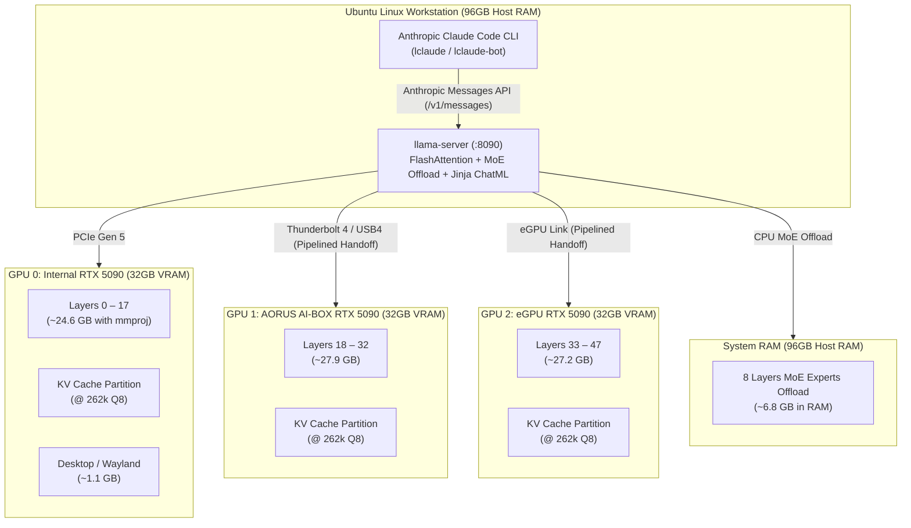

# llama-claude: Multi-GPU Local AI Engine for Claude Code

High-performance local AI inference engine powering **Anthropic Claude Code** using **Qwen3.8-Flash-Next (125B MoE / Vision / 256k Context)** and **Qwen3.8-27B (Dense / MTP)** distributed across **Triple 32GB NVIDIA GeForce RTX 5090 GPUs (96 GB Total VRAM)** with system RAM expert offloading.

---

## Architecture Overview



---

## Key Highlights

| Feature | Implementation | Benefit |
| :--- | :--- | :--- |
| **Default Model** | `Qwen3.8-Flash-Next-UD-Q4_K_XL` (125B MoE, 512 experts, 10 active) | State-of-the-art reasoning and coding quality at scale |
| **Multimodal Vision** | `mmproj-BF16.gguf` | Image understanding, diagram parsing & screenshot analysis in Claude Code |
| **Context Window** | **262,144 tokens (256k)** | Massive whole-repository context awareness |
| **Hybrid KV Footprint** | `Q8_0` (~3.5 GB total across all GPUs at 262k) | Only 12 of 48 layers carry KV cache due to Hybrid SSM / Quasi-State Attention |
| **Expert RAM Offloading** | `--n-cpu-moe 8` (~6.8 GB in RAM) | Spills only 8 layers to RAM; 40 layers run 100% in VRAM for high generation speeds (~42–46 tok/s) |
| **Multi-GPU Parallelism** | `--split-mode layer --tensor-split 18,15,15` | Pipeline parallelism over Thunderbolt/eGPU links; eliminates bus bottlenecks |
| **Reasoning Stream** | `--reasoning on --reasoning-format deepseek` | Converts `<think>` tags into native Anthropic Thinking blocks in Claude Code |
| **Compaction Headroom** | `CLAUDE_CODE_MAX_CONTEXT_TOKENS=220000` | 42k token buffer guaranteeing clean auto/manual `/compact` cycles |

---

## 1. Multi-GPU Engineering on Triple RTX 5090 & eGPU Links

### The Interconnect Bandwidth Challenge
The setup uses three RTX 5090 32GB GPUs: one internal PCIe Gen 5 card and two external enclosures connected via Thunderbolt 4 / USB4 (40 Gb/s ≈ 3.2 GB/s usable bandwidth).

* **Row Splitting (`-sm row` / Tensor Parallelism)**: Requires all-reduce synchronization across every attention head in all 48 layers (48 syncs per token). Over 40 Gb/s TB4 cables, this saturates the bus and causes severe latency.
* **Layer Splitting (`-sm layer` / Pipeline Parallelism)**: Layers are partitioned across cards (`18,15,15`). Cross-GPU transmission occurs **only once per handoff per token** (a single ~200 KB hidden-state tensor between GPU boundaries). This keeps TB4 PCIe utilization under 2%.

### Balanced VRAM & Layer Split (`--tensor-split 18,15,15`)
* **GPU 0 (Internal)**: Carries Wayland desktop (~1.1 GB), vision projector (`mmproj-BF16`, ~0.9 GB), and layers 0–17 (8 layers with experts offloaded to RAM, 10 layers with experts in VRAM) = **~24.6 GB used, ~8.0 GB free**.
* **GPU 1 (External AI-BOX)**: Layers 18–32 with full MoE experts in VRAM = **~27.9 GB used, ~4.7 GB free**.
* **GPU 2 (External eGPU)**: Layers 33–47 with full MoE experts in VRAM = **~27.2 GB used, ~5.4 GB free**.

---

## 2. Qwen3.8-Flash-Next Hybrid SSM & 256k Context Math

`Qwen3.8-Flash-Next` utilizes a hybrid architecture pairing **linear recurrent SSM states (Quasi-State Attention)** with full self-attention:
* **Only 12 of the 48 transformer layers maintain a standard KV cache**.
* **KV Cache VRAM at 256k Tokens**:
  * **Q8_0 KV Cache** (`--cache-type-k q8_0 --cache-type-v q8_0`): **~3.5 GB total (~1.2 GB per GPU)**.
  * Recurrent SSM layers maintain fixed-size state vectors that do not grow with sequence length.

---

## 3. Host System Optimization (Ubuntu Linux)

Thunderbolt eGPUs on Linux require specific kernel and PCIe settings to prevent GSP firmware timeouts (`Xid 175` / `Sysmembar` drops) caused by Active State Power Management (ASPM):

### Automated Host Setup
Run the included host configuration script:
```bash
cd host-config
sudo ./setup-host.sh
```

### Manual Configuration
1. **PCIe ASPM Performance Policy**: Prevents the USB4 PCIe controller from dropping into L1/L1.2 sleep:
   ```bash
   echo performance | sudo tee /sys/module/pcie_aspm/parameters/policy
   ```
2. **GRUB Kernel Arguments (`/etc/default/grub.d/99-nvidia-egpu.cfg`)**:
   ```bash
   GRUB_CMDLINE_LINUX_DEFAULT="$GRUB_CMDLINE_LINUX_DEFAULT pcie_aspm.policy=performance iommu=pt"
   ```
   * `iommu=pt`: Bypasses DMA remapping overhead for PCIe devices.
3. **Driver Downshift Lock (`/etc/modprobe.d/nvidia-egpu.conf`)**:
   ```bash
   options nvidia NVreg_RegistryDwords="PowerMizerEnable=0x1;PerfLevelSrc=0x2222;RMDisablePcieGenSpeedChange=1"
   ```
4. **Hotplug udev Automation (`/etc/udev/rules.d/99-nvidia-hotplug.rules`)**:
   Ensures external GPUs are created and `nvidia-persistenced` is notified whenever attached:
   ```udev
   ACTION=="add|bind", SUBSYSTEM=="pci", DRIVERS=="nvidia", ATTR{vendor}=="0x10de", RUN+="/sbin/ub-device-create"
   ACTION=="add|bind", SUBSYSTEM=="pci", DRIVERS=="nvidia", ATTR{vendor}=="0x10de", RUN+="/bin/systemctl try-restart nvidia-persistenced.service"
   ```

---

## 4. Claude Code Integration & Chat Template

### Custom Chat Template (`templates/qwen3.8-claude.jinja`)
Standard Qwen templates reject multi-turn system prompts with an `HTTP 500: System message must be at the beginning`. The custom template in `templates/` fixes this by:
* Allowing system messages at any turn index without throwing exceptions.
* Correctly formatting tool calls and tool responses for Claude Code.

### Native Thinking Stream (`--reasoning on --reasoning-format deepseek`)
Instead of dumping raw `<think>...</think>` text into conversation history, `llama-server` intercepts reasoning tokens and streams them as native **Anthropic Thinking Blocks** (`type: "thinking"` / `type: "thinking_delta"`). Claude Code displays its native collapsible thinking spinner.

---

## Quickstart

### 1. Launch Server

* **Via systemd service (recommended):**
  ```bash
  systemctl --user start llama-qwen.service
  systemctl --user status llama-qwen.service
  ```

* **Via terminal script:**
  ```bash
  ./serve.sh               # Starts default Qwen3.8-Flash-Next (125B MoE, 256k context)
  MODEL_TYPE=27b ./serve.sh # Switch to Qwen3.8-27B (Dense + MTP)
  ```

### 2. Shell Integration (`~/.bashrc`)
Add the module to your `~/.bashrc`:
```bash
[ -f "$HOME/Code/llama-claude/bash_module.sh" ] && . "$HOME/Code/llama-claude/bash_module.sh"
```

### 3. Launch Claude Code
```bash
lclaude          # Interactive Claude Code against local endpoint
lclaude-bot      # Isolated haven-bot maintainer agent
```

---

## Live Workload Telemetry

```text
Hardware:          Triple NVIDIA GeForce RTX 5090 (3x 32GB = 96GB Total VRAM)
Target Arch:       Blackwell sm_120 (CUDA 13.2 / llama.cpp b10666)
Model:             Qwen3.8-Flash-Next-UD-Q4_K_XL (125B MoE, 512 experts, 10 active)
Context Window:    262,144 tokens (256k Full Context)
RAM Expert Spillage: 8 layers (~6.8 GB in system RAM)

Prompt Processing: ~350 tokens/sec
Generation Speed:  41.8 – 45.6 tokens/sec
KV Cache at 256k:  ~3.5 GB total VRAM footprint
```
